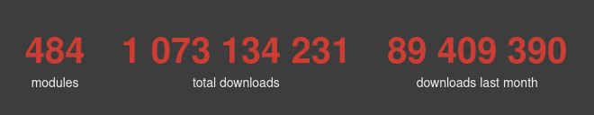

## I'm Charlike! 👋

Software Engineer for a decade, with a passion for minimalism and music. Delivering delightful digital solutions, marketing, and consultancy. _Currently excited even more about decentralized software and protocols, P2P, cryptocurrencies, and Rust._

I'm actively using Web technologies to create delightful digital experiences for the Web, Desktop, Mobile, and the Terminal. I'm helping other developers to build amazing software, apps, and products by making better and smarter developer experiences.

In the past [7 years](https://twitter.com/hashtag/6yearsOfOpenSource "#6yearsOfOpenSource"), I'm writing daily a lot of Free and Open Source software, contributing to other projects, [tweeting from @tunnckoCore](https://twitter.com/tunnckoCore) about interesting ones or sharing some of my thoughts.

I'm not just open-sourcing some random stuff by and for me. I've participated in a number of small and big projects like [@JSTransformers](https://github.com/jstransformers), [@date-fns](https://github.com/date-fns), the [@Conventional-Commits](https://github.com/conventional-commits) specification & [@Conventional-Changelog](https://github.com/conventional-changelog), [@Node-Formidable](https://github.com/node-formidable) (lead maintainer and contributor) which is also part of the growing [@Tidelift](https://github.com/tidelift) network, [@MicroJS](https://github.com/microjs) (non-active currently). And also started other projects like [@DateTime](https://github.com/datetime) & [@RegexHQ](https://github.com/regexhq), where we collaborate and maintain date & time utilities and regular expressions, with some of the biggest names in the (JavaScript) Open Source world - [@johno](https://github.com/johno), [@jonschlinkert](https://github.com/jonschlinkert), [@sindresorhus](https://github.com/sindresorhus), [@AddyOsmani](https://github.com/addyosmany), [@MathiasBynens](https://github.com/MathiasBynens), [Tom Byrer](https://github.com/tomByrer) and more. The organizations are not that active, but in general they are stable small packages and not that bad.

Combined, my software has ~110 million downloads per month, growing at a fast pace, and is used by some small and big projects & companies like

* [@Microsoft](https://github.com/microsoft) - as a deep dependency in some of their software
* [Ethereum](https://github.com/ethereum) - in several communities and tokens around it
* [@WhiteSource](https://github.com/WhiteSource) - secure and manage open source components
* [@RenovateBot](https://github.com/RenovateBot) - Automated dependency updates
* [CodeceptJS](https://codecept.io) - Modern Era Acceptance Testing Framework for Node.js
* [OrientJS](https://github.com/orientechnologies/orientjs) - Official [orientechnologies](https://github.com/orientechnologies)'s OrientDB driver for Node.js
* [@Decentraland](https://github.com/Decentraland) - open source decentralized virtual world on the blockchain
* [@ConsenSys](https://github.com/ConsenSys) - Ethereum Blockchain Solutions
* [Aragon.org](https://aragon.org) - Unstoppable decentralized organizations on Etherium
* [@TruffleSuite](https://github.com/TruffleSuite) - World-class development environment for blockchains
* [@Strapi](https://github.com/Strapi) - Open source Headless CMS to build customizable and modern APIs
* [node-formidable](https://github.com/node-formidable) is used by many in production environment 
* [@Seek-OSS](https://github.com/Seek-OSS), [@leboncoin](https://github.com/leboncoin), [Electron-Forge](https://www.electronforge.io/)

...and many more. It's just hard to track or at least takes a lot of time.

_As of November 18, 2020:_

_As of August 2021, it grown to **2.4 billion** total downloads, and 110 million per month._  
You can always dig in at my charts [on Npm-Stat.com](https://npm-stat.com/charts.html?author=tunnckocore&from=2015-08-01) (takes time to load).

_As of June 1, 2022, it grown to **3.439 billion** total downloads, and 120 million per month._ _  

## Love and Support

- For smaller recurring or one-time donations, check https://ko-fi.com/tunnckoCore
- For crypto lovers - `tunnckocore.eth` is my ENS and accepts BTC, ETH, DOGE, LTC
- If ENS domains is not supported by your wallet:
  + BTC `bc1qdfe7najz9wg9hrl0heaze8k3v9vqvewf846ct8`
  + LTC `LdKg5ubACw8dGb8ZieFwfEReyLg4frw9bc`
  + DOGE `DEhgA3xDN5CohxDMnzFdq78WHhJYYrVoC5`
  + ETH, WBTC, ERC20, & NFTs  `0xA20C07F94A127fD76E61fbeA1019cCe759225002`
- Contact me at [Twitter](https://twitter.com/tunnckoCore), or via email `dev` `at` `tunnckocore.com`
- Half of each [GitHub donation](https://github.com/sponsors/tunnckoCore) will go to other people and causes
  + _(you will get monthly info about me and my donations)_

